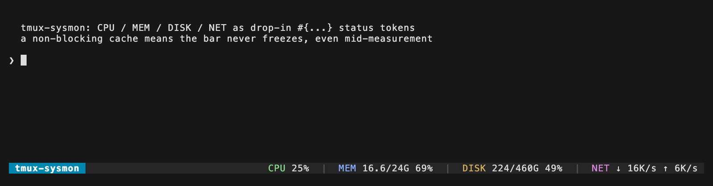
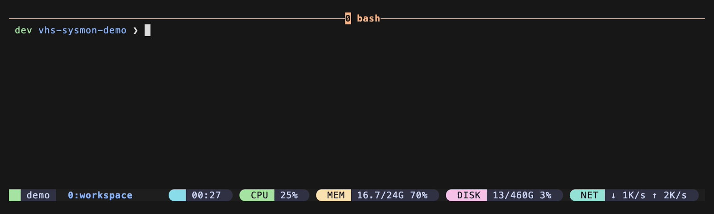

# tmux-sysmon（中文說明）

**把 CPU、記憶體、磁碟、網速做成四個可自由擺放的 `#{...}` 佔位符，放進 tmux
狀態列。** macOS 與 Linux 皆內建支援。



*四個 `#{sysmon_*}` 佔位符在 tmux 狀態列即時顯示 CPU／記憶體／磁碟／網速的真實數值，並套上自訂樣式。*

## 這是什麼？

tmux 螢幕最下方有一條狀態列。tmux-sysmon 幫你加上四個小讀數，想放哪就放哪：

- **CPU**：處理器目前有多忙（例如 `22%`）
- **記憶體**：RAM 用了多少（例如 `14.6/24G 61%`）
- **磁碟**：硬碟用了多滿（例如 `240/460G 52%`）
- **網路**：目前的下載／上傳速度（例如 `↓ 27K/s ↑ 18K/s`）

外掛只輸出純文字數值，不帶任何顏色或圖示，方便你用自己的主題去上色，融入任何
狀態列風格。

核心紀律是**非阻塞**：狀態列永遠只讀一個很小的快取檔，真正的量測都在背景進行。
因此就算某次量測很慢，也絕不會卡住你的 tmux。

> **誠實定位**：這是 tmux 生態裡很飽和的一塊——
> [tmux-cpu](https://github.com/tmux-plugins/tmux-cpu)、
> [tmux-mem-cpu-load](https://github.com/thewtex/tmux-mem-cpu-load)、以及
> `sysstat` 都有重疊。tmux-sysmon 的存在理由是：**四項指標一次到位**、嚴謹的
> **非阻塞快取**（卡住的 collector 不會拖垮狀態列）、有文件的
> **provider 契約**讓你換上自己的 collector（Rust／Go 都行，見
> [provider-contract.md](provider-contract.md)），以及與家族其他外掛
> **一致的 `@` 選項語彙**。如果你只需要單一指標且已裝了別的外掛，那也很合理。

## 快速開始

不熟 tmux 的 `prefix` 鍵？預設 prefix 是 `Ctrl-b`——先按 `Ctrl-b`，放開，再按
下一個鍵。

需要 **tmux 1.8 以上**（見下方 [系統需求](#系統需求)）。從兩條路擇一，再做第 3 步。

### 1. 安裝外掛

#### 路徑 A — 使用 TPM（tmux 外掛管理器）

若你還沒裝過 TPM，先跑這三行（原樣複製貼上）：

```sh
git clone https://github.com/tmux-plugins/tpm ~/.tmux/plugins/tpm
printf '\n%s\n' "run '~/.tmux/plugins/tpm/tpm'" >> ~/.tmux.conf
tmux source ~/.tmux.conf
```

（若 tmux 尚未執行，`tmux source` 可能印出 "no server running"，這是正常的，
設定會在下次啟動 tmux 時生效。）

接著在 `~/.tmux.conf` 裡、`run '~/.tmux/plugins/tpm/tpm'` 那行的**上方**加入：

```tmux
set -g @plugin 'operonlab/tmux-sysmon'
```

#### 路徑 B — 不用 TPM（一行，免外掛管理器）

隨便找個位置 clone，然後在 `~/.tmux.conf` 加一行：

```sh
git clone https://github.com/operonlab/tmux-sysmon ~/.tmux/plugins/tmux-sysmon
printf '%s\n' "run-shell '~/.tmux/plugins/tmux-sysmon/sysmon.tmux'" >> ~/.tmux.conf
```

### 2. 把佔位符放進狀態列

在 `status-left` 或 `status-right` 放入任意佔位符，例如：

```tmux
set -g status-right 'CPU #{sysmon_cpu} | MEM #{sysmon_mem} | DISK #{sysmon_disk} | NET #{sysmon_net}'
```

這些行要放在外掛的 `@plugin` / `run-shell` 行**之前**，外掛才能在載入時把佔位符
換成實際指令。

### 3. 重新載入（TPM 另需安裝）

```sh
tmux source ~/.tmux.conf   # 重新載入設定
```

若用 **TPM**，另外按一次 `prefix + I`（大寫 i）抓取外掛。

幾秒內四個讀數就會出現並自動更新。

## Demo



## 選項

以下皆為選填，設在 `~/.tmux.conf` 外掛行之前。

| 選項 | 預設 | 白話說明 |
|---|---|---|
| `@sysmon-interval` | `5` | 背景每隔幾秒重新量測一次。越小越即時，工作量略增。 |
| `@sysmon-disk-path` | `/` | 磁碟讀數要量哪個檔案系統，可指向任何掛載路徑。 |
| `@sysmon-provider` | *(未設)* | 用你自己的 collector 取代內建的。請見下方警告。 |

另外，tmux 本身的 `status-interval`（例如 `set -g status-interval 5`）決定狀態列
多久**重繪**一次，把它設得跟 `@sysmon-interval` 接近，新數值才會即時顯示。

### 自訂 provider（進階）

> ⚠️ **`@sysmon-provider` 會執行你提供的指令。** 只在你信任的 `~/.tmux.conf`
> 裡設定——它會在每次刷新時於背景執行你的程式，跟任何會跑程式的設定行一樣。

指向任何會把契約 JSON 印到 stdout 的程式：

```tmux
set -g @sysmon-provider '/opt/metrics/my-collector'
```

完整 schema 與「換上自己的 Rust／Go collector」說明見
[provider-contract.md](provider-contract.md)。

## 移除

執行內建的 teardown 腳本（會還原你的狀態列佔位符並清掉快取），再刪資料夾：

```sh
~/.tmux/plugins/tmux-sysmon/scripts/teardown.sh
rm -rf ~/.tmux/plugins/tmux-sysmon
```

（若用 TPM 安裝，另外把 `~/.tmux.conf` 裡的 `set -g @plugin '.../tmux-sysmon'`
那行刪掉。）

## 疑難排解 / FAQ

**在 macOS 上磁碟讀數顯示幾乎沒用（像 `13/460G 3%`）。**
這是真實且預期的行為。現代 macOS（APFS）的 `/` 是被封存的 **System** 卷宗，幾乎
是空的；你的檔案在另一個 **Data** 卷宗上。要量實際資料所在，改設：

```tmux
set -g @sysmon-disk-path '/System/Volumes/Data'
```

**剛啟動的頭幾秒讀數是空的。**
這是刻意設計。狀態列只讀快取、絕不阻塞，所以冷啟動時第一次量測在背景跑，數值會在
下一個刷新週期（`@sysmon-interval` 秒內）出現。

**網速一開始顯示 `↓ 0B/s ↑ 0B/s`，之後才正常。**
速度是兩次量測的**差值**，第一筆沒有前值可比，所以是零；下一次刷新就會填上。
（這也是測試裡第二輪一定有真實速率的原因。）

**`↓` / `↑` 箭頭變成方框或問號。**
這是純 Unicode 箭頭（U+2193 / U+2191），不是 Nerd Font 字元。若無法顯示，代表你的
終端字型不含這些字——換一個有的字型，或用自訂 `@sysmon-provider` 把 `net_display`
改成不帶箭頭的格式。

**數值看起來凍住、不更新。**
tmux 每隔 `status-interval` 秒才重繪狀態列。若它很大（或沒設），調小：
`set -g status-interval 5`。也確認 `@sysmon-interval` 沒被設成很大的值。

**完全沒有東西出現。**
確認 `#{sysmon_*}` 佔位符在 `status-left`／`status-right` 裡，且那些行在外掛行
**之前**，然後 `tmux source ~/.tmux.conf` 重新載入。可直接跑 collector 驗證：
`~/.tmux/plugins/tmux-sysmon/scripts/collect-macos.sh /`（或 `collect-linux.sh`）
應印出一行 JSON。

## 系統需求

- **tmux 1.8 以上。** 這個下限是對照一手來源查證的，不是猜的。外掛依賴 `@` 前綴
  使用者選項與 `show-options -q` / `-v` 旗標——三者都在 **tmux 1.8** 一起引入
  （官方 [tmux CHANGES](https://github.com/tmux/tmux/blob/master/CHANGES) 的
  「CHANGES FROM 1.7 TO 1.8」段落加入 `@` 使用者選項與 `show-options -q`；
  tmux 1.8 man page 的 `show-options` synopsis 為 `[-gqsvw]`，代表 `-v` 已存在）。
  狀態列 `#(shell-command)` 機制本身更古老；外掛自帶**非阻塞快取**，
  不倚賴任何較新的非同步 `#()` 行為。
- **實測於：** macOS 上的 tmux `next-3.8`（開發版）。Linux collector 在 CI 的
  `ubuntu-latest` 上真跑驗證。
- **不需要 `jq` 或其他執行期依賴**——量測只用 `awk`、`df` 等 macOS／Linux 內建
  工具。
- **平台支援：** 內建 macOS 與 Linux collector。其他 OS 若未設定
  `@sysmon-provider`，狀態列會保持空白。

## 授權

欄位名與顯示格式沿用一個本地 metrics 產生器，讓該產生器可直接當作 provider。
以 [MIT License](../LICENSE) 釋出。
